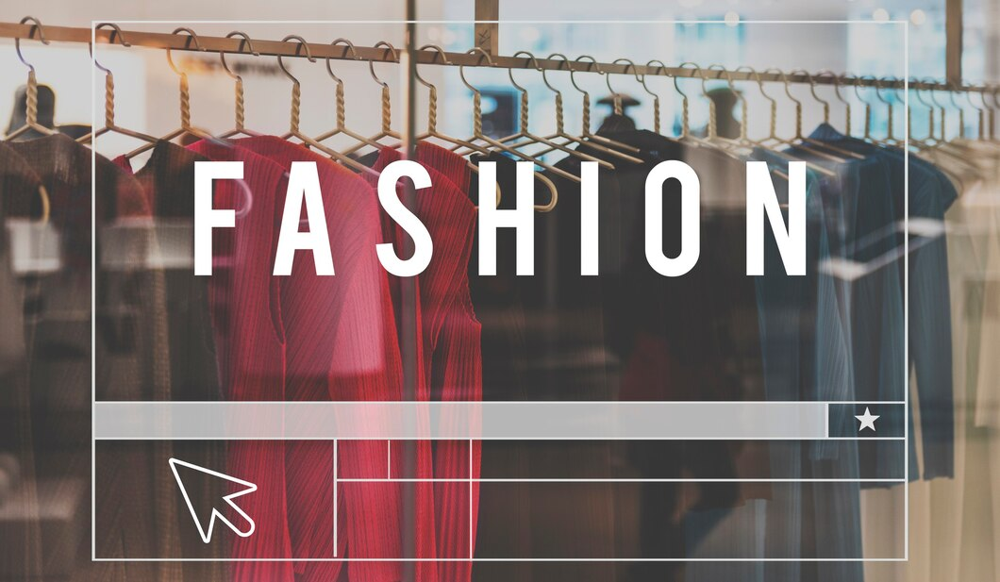

> **[플레이 데이터] 한화시스템 BEYOND SW캠프/ D.P (💥Developer Passion💥)**

## 🎬 [서버 시연 영상](https://youtu.be/oUENDKls7C4)   

## ✨ 프로젝트 설명

 - 온라인 쇼핑몰 이용자 수가 " **지속적으로 증가** " 하고 있는만큼, 쇼핑몰에 등록되는 상품의 수 역시  
   " **기하급수적으로 늘어나** " &nbsp;&nbsp;상품 선택 시 이용자가 **선택의 어려움**을 겪고 있다.
 
 
 - 따라서 **개인에게 맞는 옷, 스타일을 제공**하여 수많은 상품에 대한 선택의 폭을 줄임으로써  
   **쇼핑시간을 단축** 시켜주는 " **개인 맞춤형 패션 플랫폼 서비스** " 를 제공한다.
## 📌 프로젝트 목표
&nbsp;&nbsp;&nbsp;&nbsp;</a>
&nbsp;&nbsp;&nbsp;</a>
&nbsp;&nbsp;&nbsp;</a></a>

## 🙆‍♀️ 프로젝트 구현

> 📝 **ERD**

    

## 💻 DB Clustering 을 활용한 ???

    

대용량 트래픽을 고려한 서버 이중화

 

## 🤼‍♂️팀원

🐯 **이동규**

🐶 **유형도**

🐺 **김경미**

🐱 **정원준**

🦁 **김태윤**
